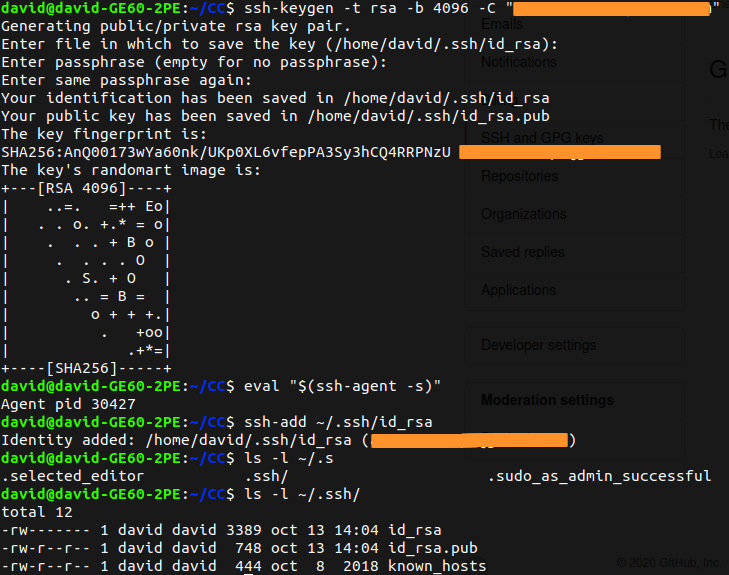
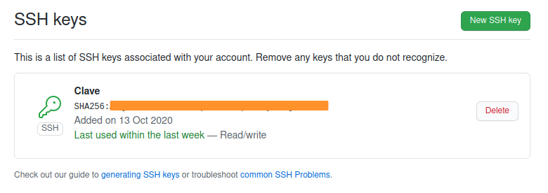
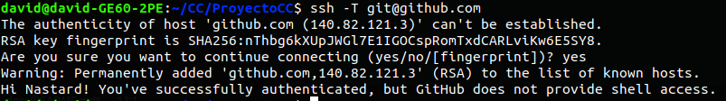
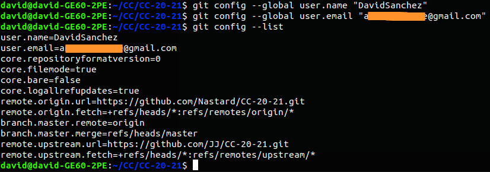
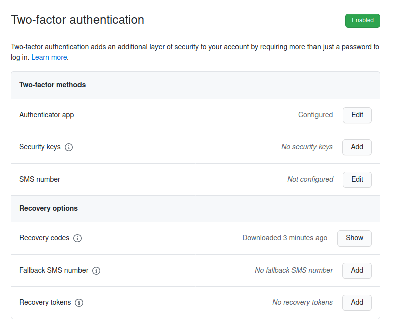

# Configuración inicial de GIT
A continuación se muestran los pasos para la creación correcta del repositorio.

## Creación de par de claves y subida de clave pública a GitHub.
Se ha usado el siguiente [tutorial](https://docs.github.com/es/free-pro-team@latest/github/authenticating-to-github/generating-a-new-ssh-key-and-adding-it-to-the-ssh-agent) para realizar esta parte.
La siguiente imagen muestra la creación de las claves, con los comandos indicados en el [tutorial](https://docs.github.com/es/free-pro-team@latest/github/authenticating-to-github/generating-a-new-ssh-key-and-adding-it-to-the-ssh-agent):\

Y a continuación la subida de la clave pública en GitHub:\
\

## Repositorios.
Los siguientes enlaces muestran los 3 repositorios de la asignatura:
- [Fork repositorio CC-20-21](https://github.com/Nastard/CC-20-21) y conexiones:\

- [Repositorio ProyectoCC](https://github.com/Nastard/ProyectoCC)
- [Repositorio EjerciciosCC](https://github.com/Nastard/EjerciciosCC)

## Configuración correcta del nombre y correo electrónico para que aparezca en los commits.
Se ha indicado con comandos cuál es el nombre y el email:\

## Edición del perfil de GitHub para que aparezca una imagen en vez del avatar por omisión, nombre completo y ciudad, así como universidad.
En la siguiente imagen se muestra los requisitos que nos pide:\

## Incrementar la seguridad de nuestra cuenta en GitHub activando el segundo factor de autenticación.
Se ha configurado la opción de doble factor de autenticación con la aplicación Authy:\

